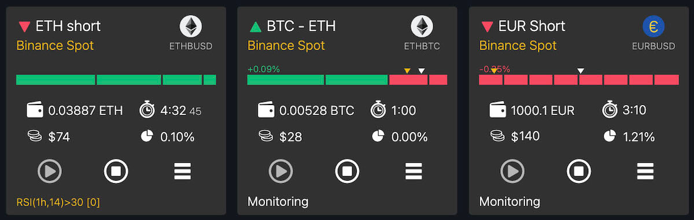
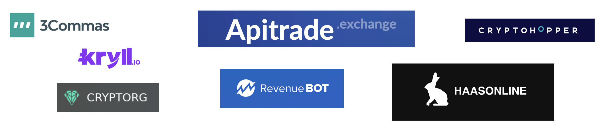

# MatrixBot presentation (eng)

### Smart bots work while you relax

<figure><figcaption></figcaption></figure>

There are huge opportunities for earning money in the world of cryptocurrencies, but for many it is not clear how to start. Our platform [<mark style="color:green;">**Matrixbot**</mark>](https://matrixbot.io) is changing that! We have developed an innovative platform that allows you to launch trading bots created by experienced traders or on your own in a convenient bot builder in two clicks. While you are resting, bots earn money, and knowledge and experience are monetized. We are plan to make <mark style="color:green;">**Matrixbot**</mark> <mark style="color:green;">**Market**</mark> the largest platform for the exchange of bots, strategies and services in the field of crypto trading. To support the project, a native token was issued [<mark style="color:green;">**MTXB**</mark>](https://matrixbot.io/token).

### Problem. Assets can work, but a mentor is needed.

<figure><figcaption></figcaption></figure>

Interest in cryptocurrencies and investment volumes are constantly growing. Easy and profitable ways to place crypto assets are limited, high volatility creates fear. At the same time, investors expect significant profit from cryptocurrency investments. Our platform offers a solution for these users, allowing them to earn passive income through bots, advisory and education services.

### The win-win solution

We offer a cloud platform to run trader-trained or AI-trained trading bots. And for professionals, a convenient constructor for creating bots and `Market` for their sale, as well as related services. Later it is planned to add the possibility of trust management.

### For whom?

* **For experienced traders.** The opportunity to receive additional income from the sale on the Market of trading bots created on the Matrixbot platform, as well as their services. Monetize your experience and creativity in crypto trading.
* **For starters.** Quick start and low threshold for entry into crypto trading. A simple and understandable choice of trading bots on the market based on real statistics of their work.
* **For crypto exchanges**. Way to increase trading volumes, customer traffic.
* **For everyone.** Passive and high income that does not require constant attention. Bots are earning for you 24/7 while you're doing your own thing.

### Why is the problem not solved before us and how do we use mathematics?



We have found a way to effectively use the problem of cryptocurrencies - high volatility. Our product is based on the most profitable algorithm that combines mathematics, probability theory, trading tools and the ability to integrate with AI. By researching all existing platforms with trading bots, we have improved working ideas, maximized the profitability of bots and added our own know-how. Bots earn regardless of whether the market rises or falls.

read more...

Existing solutions are fragmented and unsatisfactory. Some effective scripts work only on local devices, while cloud platforms with bots have primitive settings and low efficiency. We combined our knowledge and experience in trading, cryptocurrencies and IT to create a new solution that would meet the needs of users and give them the opportunity to receive high income.

Our trading bots are based on a grid algorithm, which we have perfected with a large number of settings (mathematical parameters), automation, as well as our own know-how. The bot works at a speed and amount of computation that a human cannot. A large variation of settings allows you to create completely different strategies from extremely profitable, risky, to low-risk "turn on and forget".

### Why can we succeed

<figure><figcaption></figcaption></figure>

Thanks to our experience and previous projects, we have a deep understanding of the market and user needs. We have developed a unique infographic dashboard for bots that our competitors don't have. Our infrastructure is based on advanced technologies that can withstand high loads, and we have also developed a balanced economy that provides a stable income for the platform and its users.

### Business model

<figure><figcaption></figcaption></figure>

We use several options to monetize our services.

**15% fee of the bots profit.**\
This option allows you to quickly start trading without investments, test mechanisms and calculations with real profit.

**Subscription $30 per month.**\
For regular users of the platform for each connected exchange or market on the exchange.

**10% fee per transaction on the marketplace.**\
We take a commission from each sale of bots or services on the `Market`.

**VIP services from 1000$.** Dedicated servers for independent trading, personal support, free signals and more.

[**MTXB**](https://matrixbot.io/token) **token.** The tokenomics we developed integrates `MTXB` into the platform and serves to support the project, and also plays a role in the overall capitalization.

<mark style="color:red;">**Important**</mark>. Crypto assets of clients are located on their own accounts on the exchange. Our platform only have access to two operations: buy/sell through the API provided to us by the client. Thus, we do not take responsibility for the custody of customer funds.

### Marketing

<figure><figcaption></figcaption></figure>

The initial promotion of the project is planned through the community of amateur traders, participation in IT events. Clients from this group are the first target, as this is our circle of contacts and we have already stated a serious interest in the project and positive expectations. Many became early investors in the token [<mark style="color:green;">**MTXB**</mark>](https://matrixbot.io/token).

Next, we plan to focus on positive profitability statistics and use growth and customer acquisition tools based on the initial base. Free start periods, rewards for attracting new customers, airdrops, etc.

We will connect content marketing to build long-term relationships with the target audience, we will develop our own blog and youtube channel.

### Competitors

<figure><figcaption></figcaption></figure>

We conduct constant monitoring of our competitors. The idea of ​​the project was born in the process of working with other services and the obviousness of their imperfection, the lack of the necessary functionality, which significantly increases the profitability of trading. There are two main offers on the market for running trading bots: buying ready-made bots to run locally on your device and using cloud services.

<table data-card-size="large" data-view="cards"><thead><tr><th></th><th></th><th></th></tr></thead><tbody><tr><td><strong>Bots-applications</strong></td><td><strong>Pros</strong> Effective and narrowly focused functionality, could be written by a specialist for a specific strategy. </td><td><strong>Cons</strong> Expensive one-time purchase "pig in a poke", works on one device, binds to the operating system. A thing in itself, not always updated according to the market.</td></tr><tr><td><strong>Bot platforms</strong></td><td><strong>Pros</strong> Work 24/7 on any device, a choice of different ready-made strategies, a community, regular updates. Acceptable subscription price.</td><td><strong>Cons</strong> Bots on platforms work usually slower than individually installed ones. Usually less profitable, less flexible configurations.</td></tr></tbody></table>

Comparison of popular services

* <mark style="color:red;">3commas.io</mark> - a large selection of strategies, a large community. None of the strategies has enough settings to maximise profits. Lots of restrictions.
* <mark style="color:red;">Revenue</mark> - is one of the most efficient bots but has a terrible interface. There are no improvements.
* <mark style="color:red;">Kryll, Haasonline</mark> - interesting but overcomplicated bot builders.
* <mark style="color:red;">Cryptohopper</mark> - many options are declared, but the real profitability is hidden.
* <mark style="color:red;">Cryptorg</mark> - poor functionality.
* <mark style="color:red;">Apitrade</mark> - the maximum number of functions is declared, a very incomprehensible interface, it is extremely difficult to start trading.\
  \
  `Matrixbot` will have more functionality than most platforms and will focus on maximizing the profitability of bots. Great importance is given to the simplicity and convenience of the UI, in particular to monitoring the work of bots (a cursory glance anywhere on any device is enough). There are several killer features in the plans. We are also making an open architecture for connecting exchanges or trading services to our platform, there is no such offer on the market.

### Team and partners

<figure><figcaption></figcaption></figure>

The core of a team of 5-6 developers, flexible, scalable infrastructure, with an emphasis on high load and speed. AWS Cloud Service Provider, Managed by Friend Partner (Amazon Certified).

### Financial Forecast

We plan to enter the market in Q2-Q3 2023. After attracting the first 50 customers, our platform will generate net profit. During the first year of the platform's operation, we plan to attract 3,000-5,000 customers, and by the third year - 100,000 customers. Our clients will also be able to earn money by using and selling trading bots.

### Project stage, social resources



Beta version, closed testing. The minimum required functionality is working, undergoing closed testing, and work has begun on setting up a production loop for a release candidate. Channels are launched in Telegram, Youtube, Linked, Twitter.

### ROADMAP

**1Q 2024**\
Build production environment\
Start beta-testing

**2Q 2024**\
Bybit integration\
Binance Futures integration\
Open `Marketplace`\
Finish beta-testing

**3Q 2024**\
Start Marketing program\
Start adding planned killer-features

**4Q 2024**\
New CEX, DEX integration

**2025**\
AI, NFT, DeFi, Web 3.0 integration
