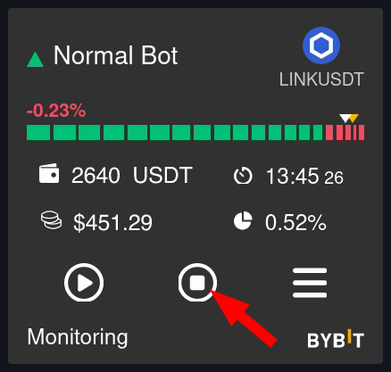

# 🤖 Dashboard



#### Top bar

.png>)

​$100.88 - Account balance on Matrixbot \
1 - Number of active bots \
$202.44 - Total profit of bots for the selected interval \
PNL - Current state of all positions, will be added in future versions\
\-90%+ - Scale display of bots

#### Iconography of a bot​

.png>)

Green triangle - Long bot\
Red triangle - Short bot\
Bot name, exchange and trading pair - clicking opens the chart on the exchange.

#### Orders and price indicator

.png>)

The number of segments corresponds to the number of orders bot `Orders`. Green segments represent unfulfilled orders, while red represents fulfilled ones. The length of each segment is the distance between `ARC` orders. A white triangle indicates the current take profit order position, while yellow shows the current price position. Percentage indicates profit/loss from executed orders.

.png>)

49.37 GTC - The bot's `limit` deposit, clicking on which will display the deposit in USD equivalent.\
16:56 - Current lap time\
$5.23 - Bot's total income\
0.45% - Bot's overall profitability in percentage terms

.png>)

Bot start. After an error, the bot will restart from its last state when the start button is pressed.

Stop. Two modes:

\- `Soft stop` on first press. The bot will stop gently and wait for take profit orders to be executed before stopping.\
\- `Hard stop` on second press. The bot will stop as is; orders may remain on the exchange or be removed at user's choice.

Additionally, if the bot is in error mode and does not plan to resume trading from where it left off, pressing the stop button clears any errors and allows a new lap to begin after restarting.

Menu. Opens up additional menu options.

#### Additional menu

.png>)

Edit - Bot editing\
Clone - Bot cloning\
Delete - Deletion

30 days - Selection of a time period for laps.\
6.45% - Total income percentage earned during the selected period, click to view statistics page.\
$5.23 - Total income earned in dollars during the selected period.

List of closed laps.

Lap number, trading pair, duration of round, number of executed orders and profit in dollars. If there is a current unclosed lap, its profit is zero. Each lap can be clicked to view details.

.png>)

Order ID assigned by the exchange, order type, amount and price at which it was placed.

.png>)

If the lap is not closed, open orders show placed but unfilled orders.&#x20;

#### Bot status bar

.png>)

Displays the current state of the bot:


* Stopped - stopped
* Initialization - preparation for starting the bot
* Waiting start - checking start conditions based on indicators. If conditions are not met, the value of a blocking indicator is displayed.
* Placing grid - placing the grid
* Monitoring  - waiting mode for order execution
* Reset grid - resetting the grid if price has moved beyond set `offset` limit.
* Placing order - placing subsequent orders&#x20;
* Lap finished - take profit order triggered, remaining orders removed&#x20;
* Error – bot has stopped with an error, click to display error description. The stop button clears errors if bot is in error mode and does not plan to resume from where it left off. After reset, bot will begin a new lap after start.


How does bot stopping work?

If you press the bot stop button once, it will turn red, and the bot will enter a waiting mode to complete the current cycle and then stop.

If the bot is in monitoring mode or waiting for indicators and no order has been executed, the bot will stop immediately.

If you press the button again, you can stop the bot immediately, with or without canceling the orders.

