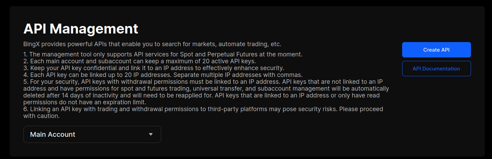
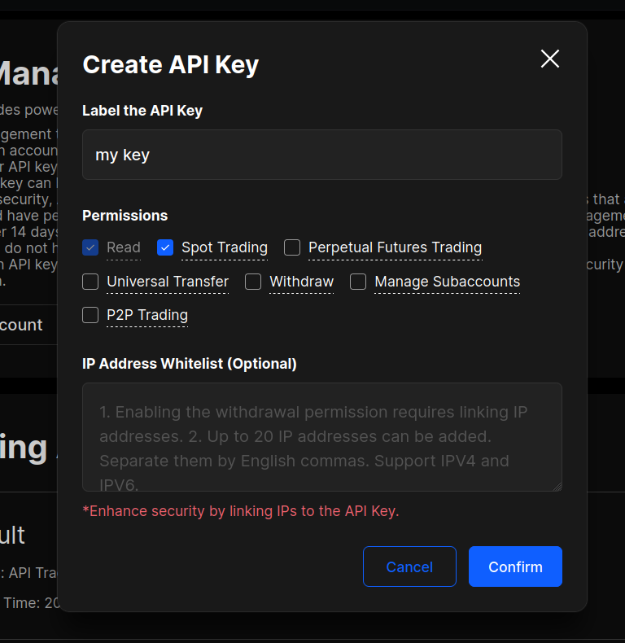
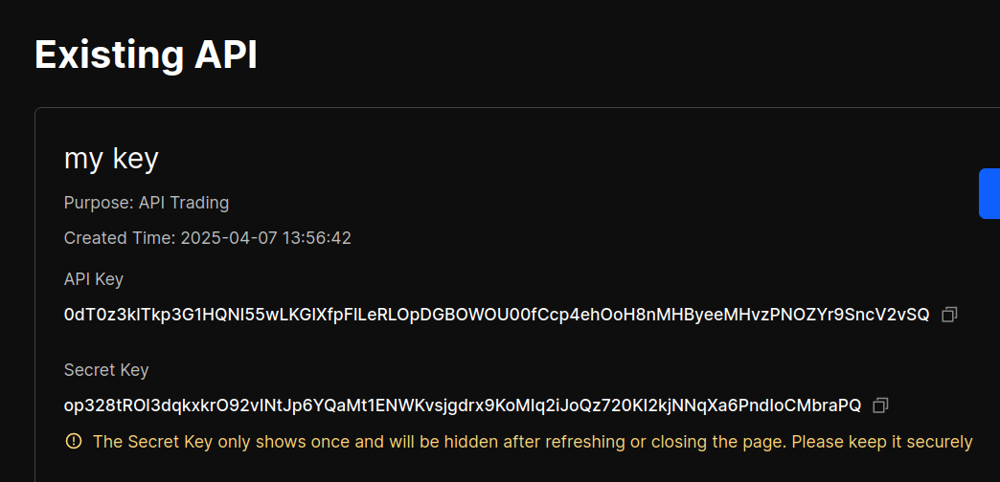
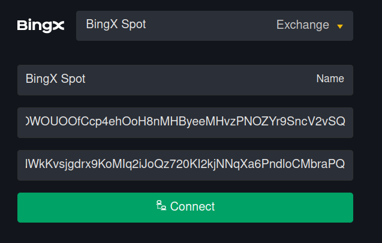

# Instructions for BingX

If you don't have a BingX account yet, [create one using this link.](https://get.matrixbot.io/share-profit/bingx)

Step 1: [Open the API Keys management page.](https://bingx.com/en/accounts/api/)

<figure><figcaption></figcaption></figure>

Step 2. Enter any name for the key, check the "Spot Trading" box and click "Confirm".

<figure><figcaption></figcaption></figure>

The system will ask for your confirmation, for example, by email and a code from an SMS.

Next, your API key will be displayed, consisting of 2 parts - public and private. Write down both parts: API Key and Secret Key.

<figure><figcaption></figcaption></figure>

Step 3. [Return to the MatrixBot](https://matrixbot.io/apikeys) interface and add your key:

Select the exchange: BingX and enter parts of the key.

Public Key is the "API Key" from the data above, then enter the Secret Key.

<figure><figcaption></figcaption></figure>

Afterwards, click on the "Connect" button. A notification should appear that the key has been successfully added.

You can check the key by clicking on the "Balance" button and see the balances of coins on the account.

<figure><figcaption></figcaption></figure>

Great! The key has been added and you can [start creating the bot.](https://matrixbot.io/ai-bot)

If you have any questions, [write to our chat.](https://t.me/matrixbotio_eng_chat)
