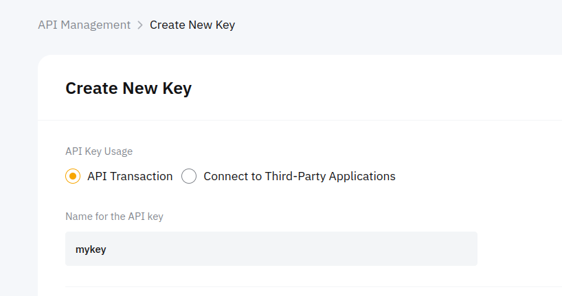
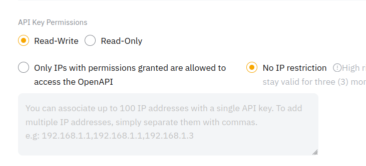
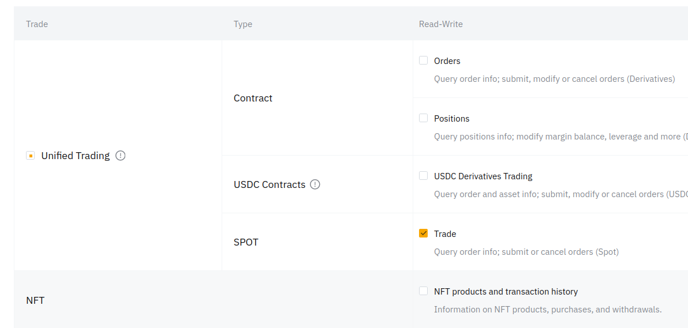
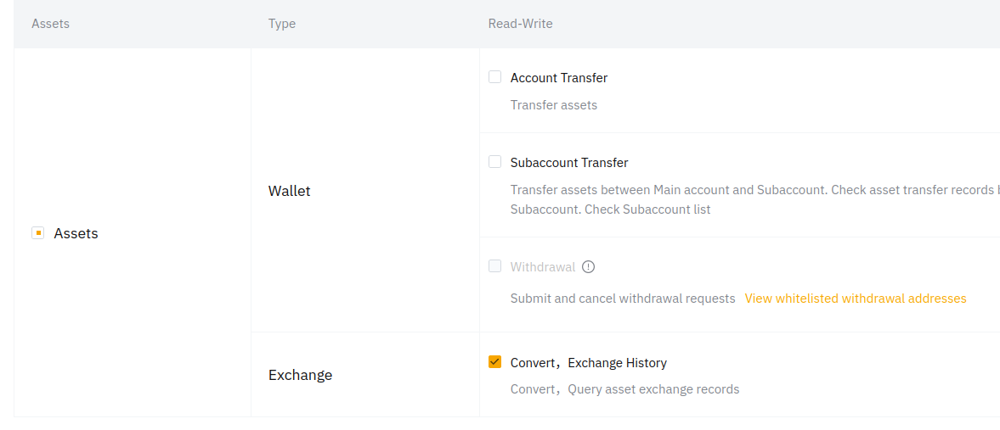
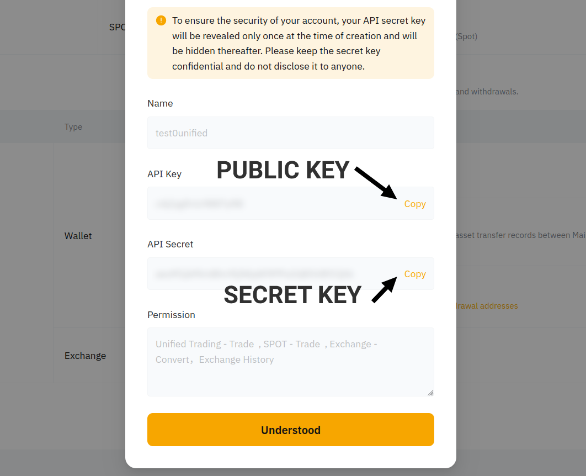
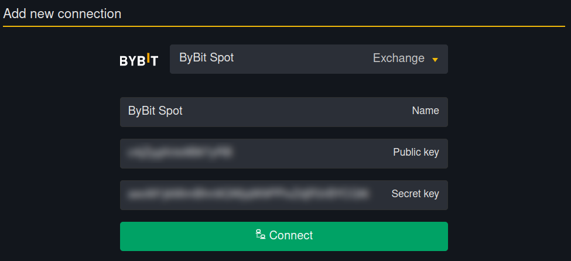
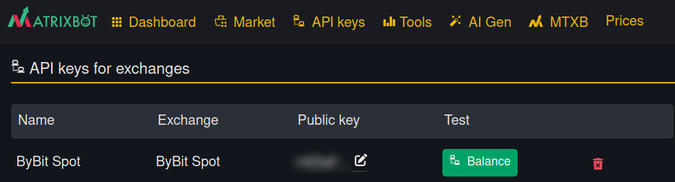

# Instructions for Bybit (website)

If you don't have a Bybit account yet, [use this link ](https://get.matrixbot.io/share-profit/bybit)to create an account and reduce your commission by 10%.

Let's go to the [API Management page.](https://www.bybit.com/app/user/api-management)

In the upper right corner of the page, find the button labeled **"Create New Key"** and click on it.

<figure><figcaption></figcaption></figure>

Next, select **"System-generated API Keys."**

<figure><figcaption></figcaption></figure>

The key type is **"API Transaction."** You can choose any name for the key.

<figure><figcaption></figcaption></figure>

Below, in the key permissions, select **"Read-Write"** so that the bots can not only retrieve balance information but also place orders.

Select **"No IP restriction"** since the IP on the platform changes periodically.

<figure><figcaption></figcaption></figure>

Next, check the permissions for the key. Make sure to tick the box for **SPOT -> Trade.**

<figure><figcaption></figcaption></figure>

Also, check the boxes for **Exchange -> Convert** and **Exchange History.**

<figure><figcaption></figcaption></figure>

All set! Click the **"Submit"** button to complete the creation of the API key.

<figure><figcaption></figcaption></figure>

A window displaying the API key information appears. We record the public and private keys.

<figure><figcaption></figcaption></figure>

Save the received public and private keys. Add them to your MatrixBot account in the [API keys section.](https://matrixbot.io/apikeys)

<figure><figcaption></figcaption></figure>

Click **"Connect."** The key will be checked for the necessary permissions and will be added to your account.

You can check the key by clicking the **"Balance"** button.

<figure><figcaption></figcaption></figure>


The API key on the exchange has a certain validity period. 30 or 90 days, then it must be extended.

To do this, just go to the list of your API keys on the exchange, click on “Edit IP access” and save without changing anything, then the key will extend its validity and will not have to be changed in running bots.


Ready! You can run bots!
