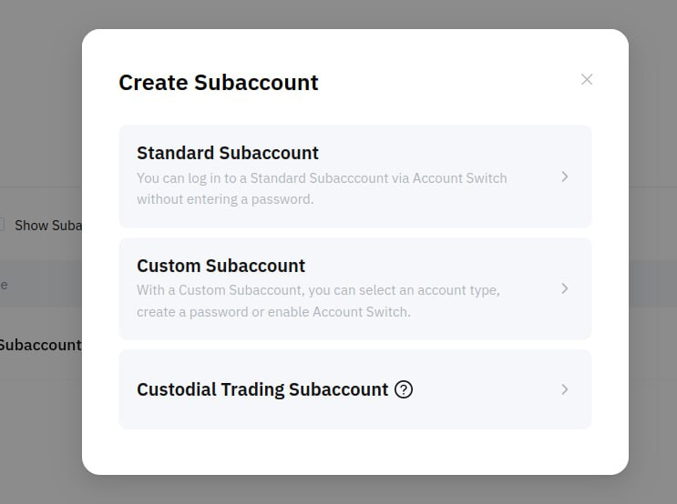
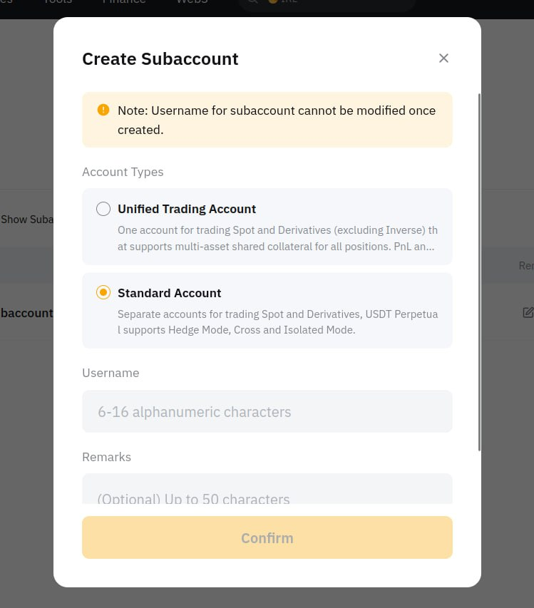
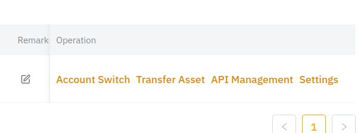
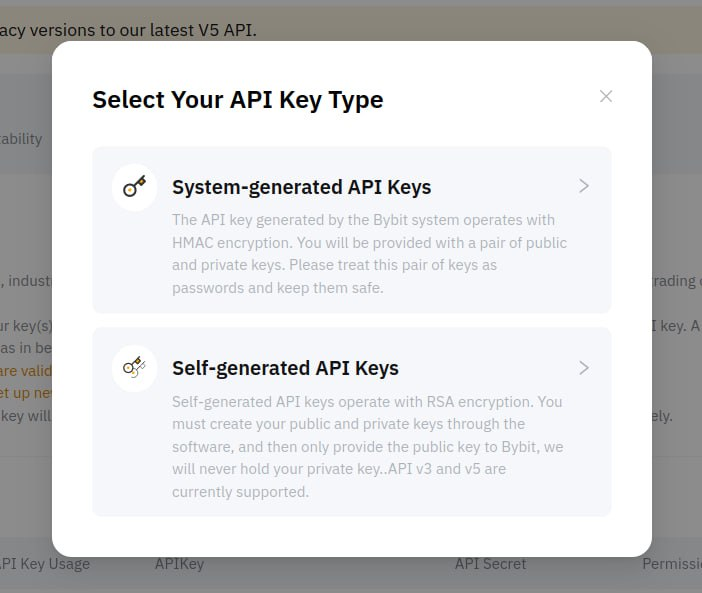

# Create an API key on Bybit

By default, Bybit opens a “unified account” account for its clients, so you need to create a sub-account in which to receive an API key to the Spot market. The fact is that API keys to “unified account” and “spot” are considered as keys to different markets.

1. [Create a sub-account](https://www.bybit.com/app/user/sub-account) for trading bots. Select "Standard Subaccount".

<figure><figcaption></figcaption></figure>

2. Next, select the type - "Standard account".

<figure><figcaption></figcaption></figure>

3. In the created sub-account, find the "API Management" link:

<figure><figcaption></figcaption></figure>

4. Create an API key to manage this account. For the API key type, select "System-generated API Keys":

<figure><figcaption></figcaption></figure>

5. Set the following permissions to the key so that the bot can request balance, order information and trade:

<figure><figcaption></figcaption></figure>

Save the received public and private keys. Add them to your MatrixBot account in the [API keys section.](https://matrixbot.io/apikeys)

Ready! You can run bots!
