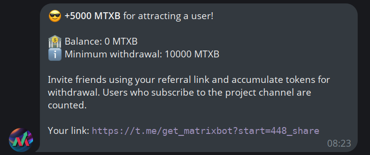
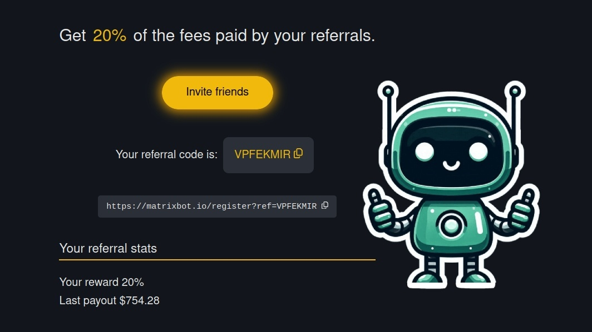
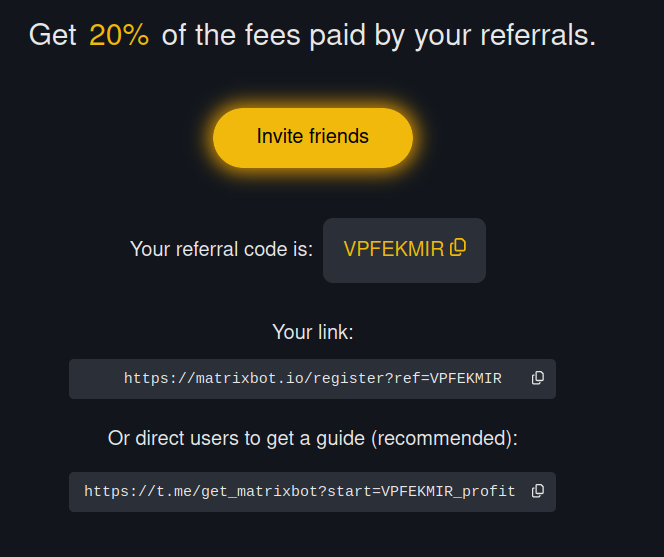
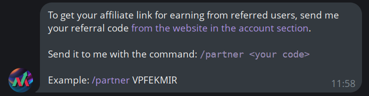

# Affiliate program

**There are 2 ways to earn money by promoting our project:**

1. Earning MTXB tokens.
2. Earn % of commissions paid by users.

## Earning MTXB tokens

To earn MTXB tokens by attracting new users, you need to[ go to our Telegram bot ](https://t.me/get\_matrixbot?start=help\_org\_ru)and send it the `/share` command.

From each new user you will receive tokens, which you can then withdraw to your wallet.

<figure><figcaption>
example link
</figcaption></figure>

## How to earn % of commissions

When you bring a new user to MatrixBot, you earn % based on everything:

1. **Commissions on income of trading bots**.
2. Commissions for **buying and selling bots on the Market**.
3. Signing up for a **premium subscription**.
4. Purchasing **VIP services.**

Advantages of working with the MatrixBot affiliate program:

1. **There is no hold**, earnings are accrued in real time.
2. **Easy conditions for approval of creatives** (if you create your own advertising materials). All you have to do is [write to the project manager](https://t.me/matrixbotio\_manager) if you have any questions.
3. **No intermediaries**, work directly with the project.

<figure><figcaption></figcaption></figure>

On the website in the "Account" section you can find your affiliate links.

You can promote both a link to register on the site and a link to receive a guide to trading bots.

When you promote a link to receive a guide, the referred user follows the link, your affiliate code is attached to it, and when the user proceeds to register, they receive your affiliate link.

<figure><figcaption>
example links
</figcaption></figure>

### An additional way to receive a link to promote the guide.

To do this, [go to our Telegram bot](https://t.me/get\_matrixbot?start=help\_org\_ru) and send it the command `/partner`

<figure><figcaption>
example bot response
</figcaption></figure>

### Important! What is prohibited

Spam and brand context (MatrixBot) are prohibited.
