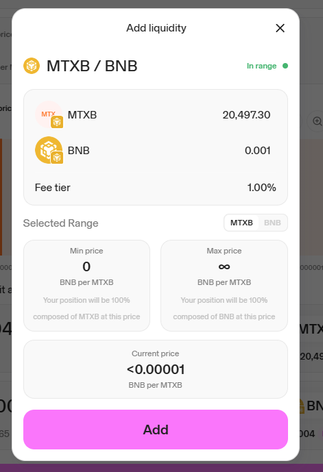

# How to add MTXB liquidity pool to Uniswap

**Step 1.** Go to Uniswap [https://app.uniswap.org/](https://app.uniswap.org/)

and connect your wallet (supported only Uniswap Wallet, Exodus, MetaMask, WalletConnect, Coinbase Wallet).

Turn off ad blockers, this is important. Be patient, do not press the buttons repeatedly, otherwise there will be several transactions.

Next, select Pools - Create position

<figure><figcaption></figcaption></figure>

**Step 2:** Select BNB Chain

<figure><figcaption></figcaption></figure>

**Step 3.** Select MTXB token (MTXB contract address: `0x3A146E3EFB59567366B0C94FFFA97273736ADBB1`) and BNB, select the commission size (for example, 1%), set the price range (you can select Full Range or custom price range).

<figure><figcaption></figcaption></figure>

Enter the amount of tokens, or set "Max" for the maximum number of tokens.

<figure><figcaption></figcaption></figure>

**Step 4.** Click the Preview button, check the liquidity position data, then click the Add button and confirm the transaction in the wallet.

<figure><figcaption></figcaption></figure>

Once completed, you will be able to view and manage your liquidity position on the V3 pool page [https://app.uniswap.org/pools](https://app.uniswap.org/pools).

Done! You are wonderful!

Now you will collect commissions from trading our token and will be able to periodically withdraw your earnings to your wallet.
