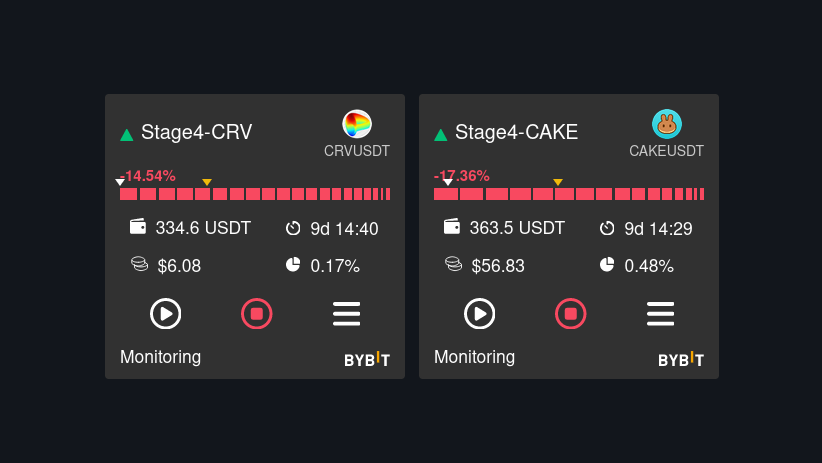
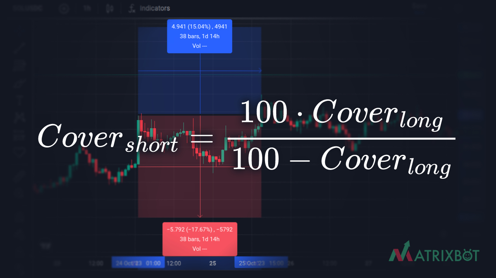
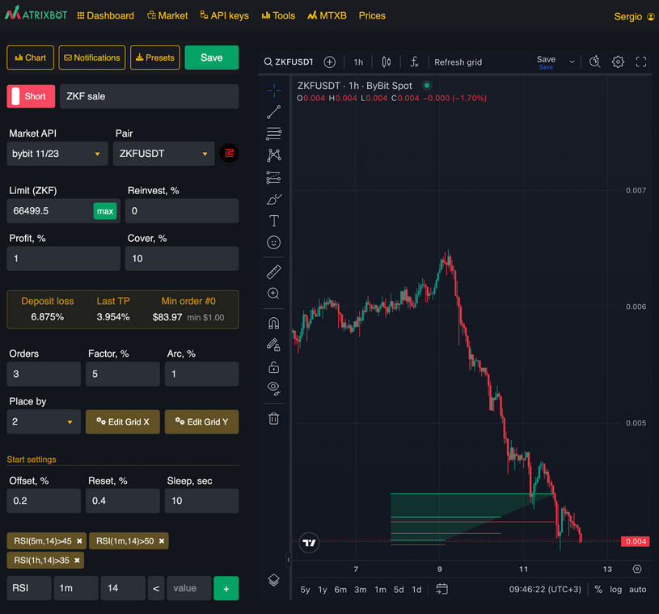

# What should you do if your bot goes into "investment" mode?

<figure><figcaption>
Bots in investment mode
</figcaption></figure>

To exit investment mode, let's first analyze why the bot entered it.

#### Possible reasons:

1. market behavior influenced by news;
2. characteristic market behavior of the chosen coin;
3. technical reason: overly aggressive bot settings.

### Typical situations

**Situation 1**: Overly aggressive settings of a LONG bot:

* insufficient order coverage (**cover** parameter);
* too low averaging down value (**factor**);
* too high expected profit value (**profit**).

In this situation, the bot has accumulated coins. To prevent the asset from idling, you can start a SHORT bot with the number of coins it has collected to increase them. The main thing is to avoid FOMO to not enter a secondary investment.

#### Main rules for exiting this situation:

* the **cover** should be twice (or more) than the distance to the Take Profit order of the LONG bot. The grid visualization can be seen when editing the bot to evaluate these distances on the chart;
* use a high **factor** value so that the **Last TP** parameter is at 50% of the **cover** value, so that the grid collects small price bounces well, as there may not be large bounces during active growth;
* the more orders in the grid, the better, as the position will average more often, catching all bounces;
* set up a careful entry into the position based on [technical indicators](../indicators.md).
* the **cover** for the SHORT bot can be calculated based on the cover of the LONG bot as follows:

<figure><figcaption></figcaption></figure>

Example: if the cover for the LONG bot is 20%, then the cover for the SHORT bot will be = 20% / (100%-20%) = 25%. This is because percentages from top to bottom and from bottom to top are different, we just recalculate them.

### Examples of bots that help exit investment can be found on the [Market](https://matrixbot.io/market) under the name "anti-invest".

***

**Situation 2**: The price sharply went down, there was a small bounce, and the bot missed it, the asset continued to trade in a different range.

#### Main rules for exiting this situation:

* make decisions calmly;
* come to terms with this small loss;
* if confident in the bot's settings, restart it to enter a new position;
* if necessary, adjust the settings, restart the bot.

In trading, such things happen, but bots are capable of working off these losses and continuing to earn.

***

**Situation 3**: Negative news about the coin emerged for a long term, for example:

1. delisting of the coin from a major exchange;
2. problems with the coin's team;
3. infrastructural breakdowns, etc.

In this case, it is advisable to exit this asset carefully using a SHORT bot.

#### Main rules for exiting this situation:

* create a SHORT bot with 3-5 orders;
* assess bounces in % that occurred during the fall, set **cover** to this magnitude;
* set indicators so that the bot sells at highs, for example, `RSI > 50`;
* if you need to quickly get rid of the asset, you can set up a grid with only 1 order under conditions of an `RSI indicator > 60`. **Profit** can be set at 0.7 or higher.

In this case, you get a very aggressive selling bot, capable of significantly increasing the asset if the price maintains volatility, which will allow you to recover the minus.

### Examples of such bots can be found on the [Market](https://matrixbot.io/market) under the name "sale".

<figure><figcaption>
Example of settings
</figcaption></figure>

***

Successful trading is not about 100% successful trades, but about a positive profit-to-loss ratio from many trades. Happy trading!
