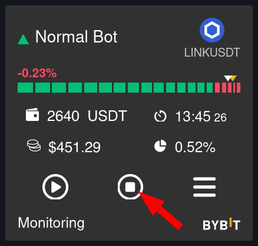

# 🤖 Dashboard: страница мониторинга



#### Верхняя строка

.png>)

$100.88  - Баланс аккаунта на Matrixbot\
1              - Количество активных ботов\
$202.44  - Общий профит ботов за выбранный интервал\
PNL         - Текущее состояние всех позиций, будет добавлено в следующих версиях\
\-90%+     - Масштаб отображения ботов

#### Иконографика бота

#### .png>)

Треугольник зеленый - Long бот\
Треугольник красный - Short бот\
Название бота, биржа\
Торговая пара - по клику откроется график на бирже.&#x20;

#### Индикатор ордеров и цены

.png>)

Количество сегментов соответствует количеству ордеров бота `Orders`. \
Зеленые сегменты - не исполненные ордера.\
Красные - исполненные.\
Длинна сегментов - расстояние между ордерами `ARC`.\
Белый маркер - расположение текущего ордера take profit.\
Желтый - расположение текущей цены.\
Процент - профит/убыток по исполненным ордерам при текущей цене.&#x20;

.png>)

49.37 GTC - Депозит бота `limit`, по клику депозит будет показан в usd эквиваленте. \
16:56 - Время текущего круга. \
$5.23 - Общий доход бота.\
0.45% - Общая доходность бота в процентах.

.png>)

Старт бота. После ошибки бот по кнопке старт запустится с последнего состояния.

Стоп. Два режима:

\- `Soft stop` первое нажатие. Мягкая остановка, бот дождется исполнения take profit ордера и остановится.\
\- `Hard stop` повторное нажатие. Бот будет остановлен как есть, ордера по выбору пользователя могут остаться на бирже или быть убраны.&#x20;

Так же кнопка стоп производит очистку ошибки, если бот в режиме `error` и не планируется возобновлять круг с того же места. После сброса, бот начнет новый круг после старта. &#x20;

Меню. Открытие дополнительного меню.

#### Дополнительное меню

&#x20;.png>)

`Edit` редактирование бота\
`Clone` клонирование бота\
`Delete` удаление\
\
30 days - Выбор временного периода для выписки по кругам. \
6.45% - Общий доход в % за выбранный период, по клику переход на страницу статистики.\
$5.23 - Общий доход в долларах за выбранный период.\
\
Список закрытых кругов. \
Порядковый номер круга, торговая пара, длительность круга, количество исполненных ордеров и профит в долларах. Если есть текущий незакрытый круг, то его профит равен нулю. Каждый круг можно кликнуть для просмотра деталей.\
\
.png>)   \
\
Order ID присвоенный биржей, тип ордера, сумма и цена по которой он был выставлен.

.png>) \
&#x20;\
Если круг не закрыт, open orders показывает размещенные, но не исполненные ордера.

#### Статусная строка бота

.png>)

Отображает текущее состояние бота:


* Stopped - остановлен
* Initialization - подготовка к старту бота
* Waiting start - проверка условий старта по индикаторам. Если условия не выполнены, то отображается значение блокирующего индикатора.  \
  .png>)
* Placing grid - размещение сетки
* Monitoring  - режим ожидания исполнения ордеров
* Reset grid - переустановка сетки, если цена ушла более чем задано в `offest`
* Placing order - размещение очередных ордеров
* Lap finished - сработал take profit ордер, удаление оставшихся ордеров
* Error - бот остановлен с ошибкой, по клику вывод описания ошибки. Кнопка стоп производит очистку ошибки, если бот в режиме `error` и не планируется возобновлять круг с того же места. После сброса, бот начнет новый круг после старта. &#x20;


<strong>Как работает остановка бота?</strong>

Если нажать на кнопку остановки бота 1 раз, то кнопка станет красной и бот перейдет в режим ожидания завершения круга и тогда остановится.

Если бот при этом находится в мониторинге или в ожидании индикаторов и при этом ни один ордер не был исполнен, тогда бот остановится сразу.

Если нажать на нее еще раз, можно будет остановить бота в данный момент, также с\без отменой ордеров.

