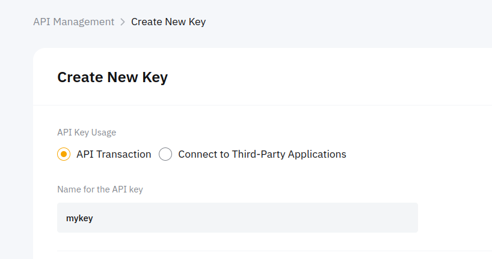
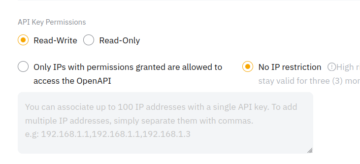
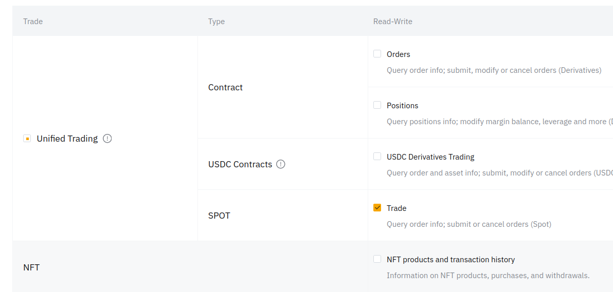
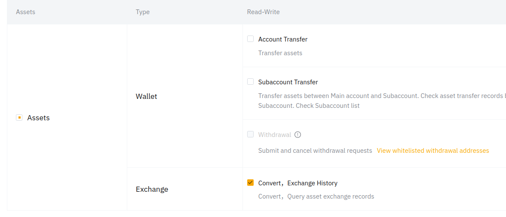
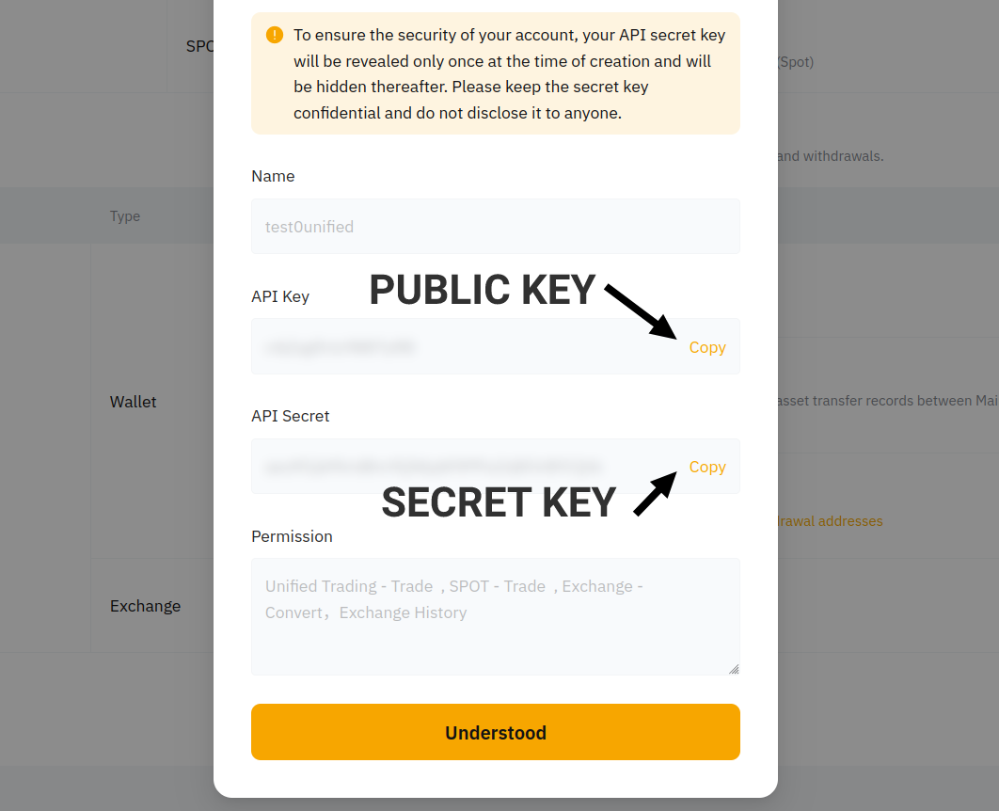
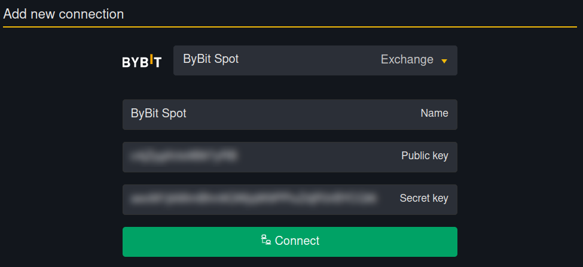
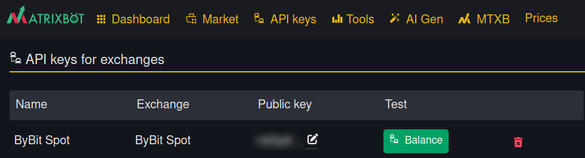

# Инструкция для Bybit (на сайте)

Если у тебя еще нет аккаунта на Bybit, [воспользуйся этой ссылкой](https://get.matrixbot.io/share-profit/bybit), чтобы создать аккаунт и снизить комиссию на 10%.

Переходим к странице [API Management.](https://www.bybit.com/app/user/api-management)

Справа вверху страницы находим кнопку "Create New Key", нажимаем на нее.

<figure><figcaption></figcaption></figure>

Далее выбираем "System-generated API Keys":

<figure><figcaption></figcaption></figure>

Тип ключа "API Transaction". Имя для ключа можно придумать любое.

<figure><figcaption></figcaption></figure>

**Ниже в разрешениях ключа выбираем "Read-Write",** чтобы боты могли не только получать данные о балансе, но и могли размещать ордера.

**Выбираем "No IP restriction".** Так как на платформе IP меняется периодически.

<figure><figcaption></figcaption></figure>

Далее отмечаем разрешения ключу. Отмечаем галку у SPOT -> Trade.

<figure><figcaption></figcaption></figure>

И отмечаем галку Exchange -> Convert, Exchange History.

<figure><figcaption></figcaption></figure>

Готово, жмем кнопку "Submit", чтобы закончить создание API ключа.

<figure><figcaption></figcaption></figure>

Отображается окошко с данными API ключа. Записываем публичный и приватный ключи.

<figure><figcaption></figcaption></figure>

Затем добавляем созданный ключ [в разделе API keys](https://matrixbot.io/apikeys) на сайте MatrixBot:

<figure><figcaption></figcaption></figure>

Жмем "Connect", ключ будет проверен на необходимые доступы и добавится в аккаунт.

Проверить ключ можно кнопкой "Balance":

<figure><figcaption></figcaption></figure>


API ключ на бирже имеет определенный срок действия. 30 или 90 дней, затем его надо продлять.

Для этого достаточно зайти в список своих API ключей на бирже, нажать на "Edit IP access" и сохранить ничего не меняя, тогда ключ продлит свое действие и его не придется менять в работающих ботах.


Готово! Можно запускать ботов!
