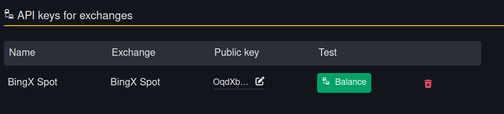

# Инструкция по BingX

Шаг 1. [Откройте страницу управления](https://bingx.com/en/accounts/api/) API ключами.

Нажмите на кнопку "Create API".

<figure><figcaption></figcaption></figure>

Шаг 2. Введите любое имя для ключа, отметьте галочку "Spot Trading" и нажмите "Confirm".

<figure><figcaption></figcaption></figure>

Система запросит ваше подтверждение, например, по email и коду из смс.

Далее отобразится ваш API ключ, состоящий из 2 частей - публичной и приватной части. Запишите себе обе части: API Key и Secret Key.

<figure><figcaption></figcaption></figure>

Шаг 3. [Возвращаемся к интерфейсу MatrixBot](https://matrixbot.io/apikeys) и добавляем свой ключ:

Выбираем биржу: BingX и вводим части ключа.

Public Key - это "API Key" из данных выше, далее вводим Secret Key.

<figure><figcaption></figcaption></figure>

После жмем на кнопку "Connect". Должно появиться уведомление, что ключ успешно добавлен.

Ключ можно проверить, нажав на кнопку "Balance" и увидеть балансы по монетам на аккаунте.

<figure><figcaption></figcaption></figure>

Отлично! Ключ добавлен и можно [приступать к созданию бота.](https://matrixbot.io/ai-bot)

Если возникли какие-либо вопросы, [пиши в наш чат.](https://t.me/matrixbotio_ru_chat)
