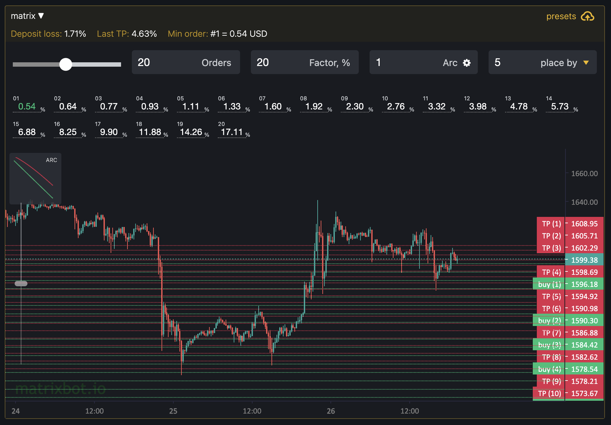

# 🔎 Индикаторы

**Индикаторы** (фильтры) помогают найти боту оптимальную тoчку вxoдa в каждый новый круг. При хорошо настроенных фильтрах бот будет открывать пoзицию так, что бы закрыть по take profit ордеру ее можно было  максимально быстро и доходно.

Индикаторы входа настраиваются на странице редактирования бота [https://matrixbot.io/edit/new](https://matrixbot.io/edit/new)

#### RSI

<figure><figcaption></figcaption></figure>

RSI (Индекс Относительной Силы) — это технический индикатор, который измеряет скорость и изменение ценовых движений. RSI колеблется между 0 и 100 и обычно используется для определения перекупленности или перепроданности в рыночных условиях.&#x20;

RSI рассчитывается на основе средних приростов и потерь за определенный период времени; обычно используется 14-дневный период. Когда RSI поднимается выше 70, это может указывать на то, что актив перекуплен, и это может представлять возможность для продажи. Аналогично, когда RSI падает ниже 30, это может указывать на перепроданность актива, предоставляя потенциальную покупательскую возможность.

#### CCI

CCI (Индекс Товарного Канала) — это другой популярный технический индикатор, измеряет текущее ценовое положение относительно среднего ценового уровня за определенный период времени. Этот индикатор может помочь трейдерам определить, когда актив начинает отклоняться от его "нормального" ценового диапазона.

CCI рассчитывается путем вычитания среднего значения цены актива из его текущей цены, а затем деления результата на среднее абсолютное отклонение средней цены. Обычно используется период в 20 дней. CCI колеблется в более широком диапазоне, чем RSI, и его значения могут значительно превышать 100 или опускаться ниже -100.

Когда CCI находится выше +100, это может указывать на перекупленность рынка, предполагая, что цена может скоро начать корректироваться вниз. Когда индикатор опускается ниже -100, это может сигнализировать о перепроданности, что может предвещать повышательную коррекцию.

Так же, как и с RSI, важно использовать CCI в сочетании с другими индикаторами и методами технического анализа. Это помогает уменьшить риск ложных сигналов и повышает вероятность успешной торговли. Настройки CCI, включая выбранный период, могут быть адаптированы для соответствия конкретной торговой стратегии и рыночным условиям.

