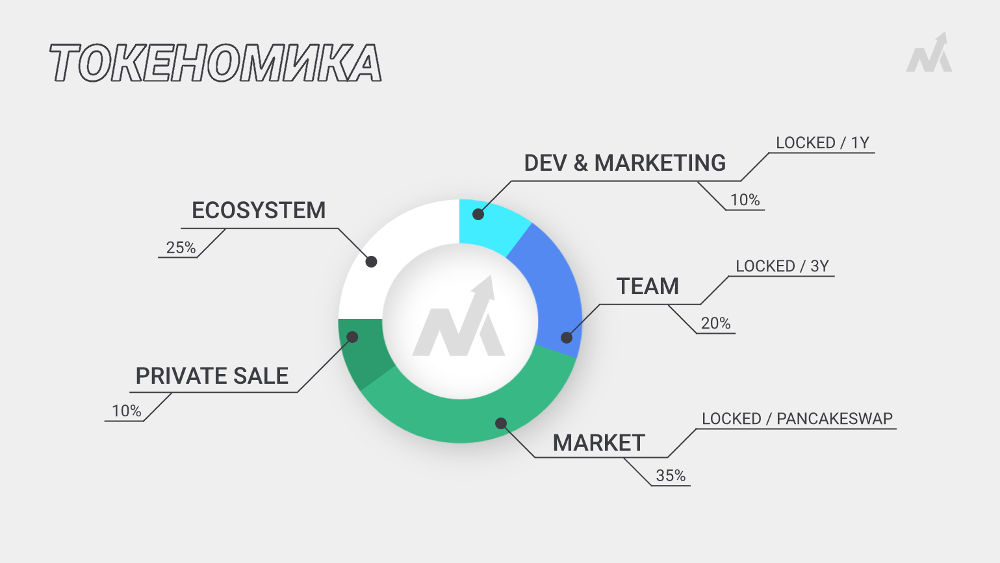
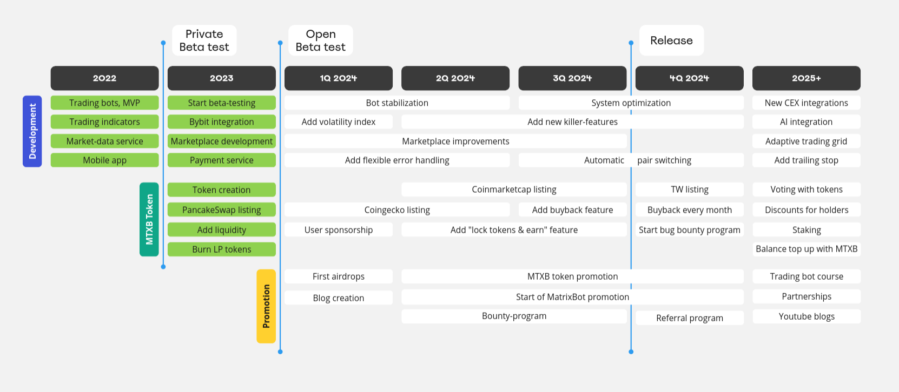

# MatrixBot.io Token (MTXB)

**MTXB** - криптовалюта торговой платформы **MatrixBot**: проекта, который значительно снижает порог входа трейдерам для торговли в крипто-мире, используя матрикс ботов.

Токен интегрируется в платформу и применяется трейдерами, чтобы снижать комиссии, оплачивать услуги и принимать решения в развитии проекта.

### Не обязательно быть трейдером, чтобы заработать на токенах MTXB

Мы ежемесячно выкупаем токены с рынка от доли прибыли проекта, а также предлагаем выгодные условия для стейкинга и лока токенов в пуле ликвидности, чтобы получать дополнительную доходность.


[kak-bystro-kupit-mtxb.md](kak-bystro-kupit-mtxb.md)



[kak-kupit-mtxb-na-pancakeswap.md](kak-kupit-mtxb-na-pancakeswap.md)


<figure><figcaption></figcaption></figure>

<table data-header-hidden><thead><tr><th width="197"></th><th></th></tr></thead><tbody><tr><td>Адрес контракта</td><td>0x3A146E3EFB59567366B0C94FFFA97273736ADBB1</td></tr></tbody></table>

## Триггеры роста и применение токена MTXB:

* **Buyback**: выкуп токенов с рынка за счет прибыли проекта.
* **Пополнение баланса** с премией для оплаты комиссий с дохода ботов.
* **Скидки** на услуги держателям токена: MTXB выгодно холдить.
* **Голосования** за решения по развитию платформы: доступ к DAO и governance функция.
* **Bounty-программа:** поощрение пользователей за привлечение друзей.
* **Доступ к VIP-услугам:** выделенные сервера под скоростных ботов.
* **Стейкинг и лок на бирже:** возможности получать дополнительную доходность.

<figure><figcaption>
Дорожная карта проекта на 2022-2025 год. Проект планомерно достигает поставленных целей
</figcaption></figure>

Общее число токенов: 1 000 000 000.

### Прозрачность

* Лок токенов на разработку и маркетинг: [PROOF](https://tokentool.bitbond.com/tokenlocker/0x361eF8f2f19E81A0c1427949475C749A0762cB03/56).
* Лок токенов команды: [1 ](https://tokentool.bitbond.com/tokenlocker/0x2E7782B266d66587b663957077FF3dB6252a25E3/56)[2](https://tokentool.bitbond.com/tokenlocker/0x9A8DBc9968b5A7c35f38B4bCa1D1a192655E5a79/56) [3 ](https://tokentool.bitbond.com/tokenlocker/0xA6aaEbD6efE69273f034e26a1a89C727841652CF/56)[4](https://tokentool.bitbond.com/tokenlocker/0x1B685E3763903E981C4d028226C76a37bc3f4365/56) [5](https://tokentool.bitbond.com/tokenlocker/0x784573BC8a149AD4c65D4c32c21d029b5c943327/56).
* LP токены сожжены: [PROOF](https://bscscan.com/tx/0x0839d96c702b13cc7073b70944d94f134b41c58ad8099d6f71adc9ed919ebe06).
* [MatrixBot в Linkedin](https://www.linkedin.com/company/matrixbot).


[kak-bystro-kupit-mtxb.md](kak-bystro-kupit-mtxb.md)



[kak-kupit-mtxb-na-pancakeswap.md](kak-kupit-mtxb-na-pancakeswap.md)


## Полезные ссылки по токену MTXB

<table data-card-size="large" data-view="cards"><thead><tr><th></th><th></th><th></th><th data-hidden data-card-cover data-type="files"></th><th data-hidden data-card-target data-type="content-ref"></th></tr></thead><tbody><tr><td><strong>BLOCK EXPLORER</strong></td><td>позволяет отслеживать транзакции MTXB</td><td></td><td><a href="../.gitbook/assets/explorer.jpg">explorer.jpg</a></td><td><a href="https://bscscan.com/token/0X3A146E3EFB59567366B0C94FFFA97273736ADBB1">https://bscscan.com/token/0X3A146E3EFB59567366B0C94FFFA97273736ADBB1</a></td></tr><tr><td><strong>PANCAKESWAP</strong></td><td>DEX биржа для обмена токенов MTXB</td><td></td><td><a href="../.gitbook/assets/pancake.jpg">pancake.jpg</a></td><td><a href="https://pancakeswap.finance/swap?outputCurrency=0x3A146E3EFB59567366B0C94FFFA97273736ADBB1">https://pancakeswap.finance/swap?outputCurrency=0x3A146E3EFB59567366B0C94FFFA97273736ADBB1</a></td></tr><tr><td><strong>GECKO TERMINAL</strong></td><td>терминал для просмотра информации о токене MTXB</td><td></td><td><a href="../.gitbook/assets/terminal.jpg">terminal.jpg</a></td><td><a href="https://www.geckoterminal.com/bsc/pools/0x3bb3577870cd26cca0e663a9435b393c224b3037">https://www.geckoterminal.com/bsc/pools/0x3bb3577870cd26cca0e663a9435b393c224b3037</a></td></tr><tr><td><strong>CONTRACT SOURCE</strong></td><td>исходный код контракта MTXB</td><td></td><td><a href="../.gitbook/assets/source.jpg">source.jpg</a></td><td><a href="https://github.com/matrixbotio/token">https://github.com/matrixbotio/token</a></td></tr></tbody></table>

## Полезные ссылки по платформе MatrixBot

<table data-view="cards"><thead><tr><th></th><th></th><th></th><th data-hidden data-card-cover data-type="files"></th><th data-hidden data-card-target data-type="content-ref"></th></tr></thead><tbody><tr><td><strong>TELEGRAM CHAT</strong></td><td>чат для обмена опытом торговли матрикс ботами</td><td></td><td><a href="../.gitbook/assets/telegram_chat.jpg">telegram_chat.jpg</a></td><td><a href="https://t.me/matrixbotio_ru_chat">https://t.me/matrixbotio_ru_chat</a></td></tr><tr><td><strong>BLOG</strong></td><td>наш блог со статьями про трейдинг и ботов</td><td></td><td><a href="../.gitbook/assets/dzen.jpg">dzen.jpg</a></td><td><a href="https://dzen.ru/matrixbot">https://dzen.ru/matrixbot</a></td></tr><tr><td><strong>TELEGRAM</strong></td><td>канал с последними новостями проекта</td><td></td><td><a href="../.gitbook/assets/telegram.jpg">telegram.jpg</a></td><td><a href="https://t.me/matrixbotio">https://t.me/matrixbotio</a></td></tr><tr><td><strong>YOUTUBE</strong></td><td>видео-инструкции по платформе</td><td></td><td><a href="../.gitbook/assets/youtube.jpg">youtube.jpg</a></td><td><a href="https://www.youtube.com/@matrixbotio">https://www.youtube.com/@matrixbotio</a></td></tr><tr><td><strong>TWITTER</strong></td><td>аирдропы MTXB токенов, новости и крипто-мемы</td><td></td><td><a href="../.gitbook/assets/twitter.jpg">twitter.jpg</a></td><td></td></tr><tr><td><strong>ANDROID APP</strong></td><td>приложение для смартфона на Play Market</td><td></td><td><a href="../.gitbook/assets/play_market.jpg">play_market.jpg</a></td><td></td></tr></tbody></table>
