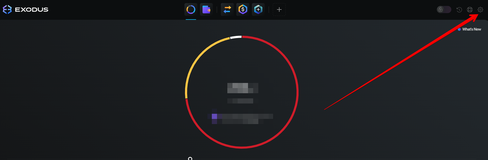

# Как добавить MTXB токен в кошелек Exodus

1. В клиенте Exodus для компьютера перейди в раздел "Settings":

<figure><figcaption></figcaption></figure>

2. Далее на вкладке "Assets" в выпадающем списке выбери "Add custom token":

<figure><figcaption></figcaption></figure>

3. Выбери сеть "BNB Smart Chain", нажми "Search":

<figure><figcaption></figcaption></figure>

4. Введи адрес смарт-контракта:

```
0x3a146e3efb59567366b0c94fffa97273736adbb1
```

<figure><figcaption></figcaption></figure>

5. Выбери "MatrixBot.io Token" и нажми "Add token".

Готово! Токен отобразится в кошельке на пк-клиенте. Чтобы он отобразился в мобильном кошельке или в веб-расширении, необходимо проделать те же операции.

**А теперь самое время получить 500 токенов MTXB себе на счет!** [Напиши нашему менеджеру](https://t.me/matrixbotio\_manager) и скинь свой адрес кошелька.
