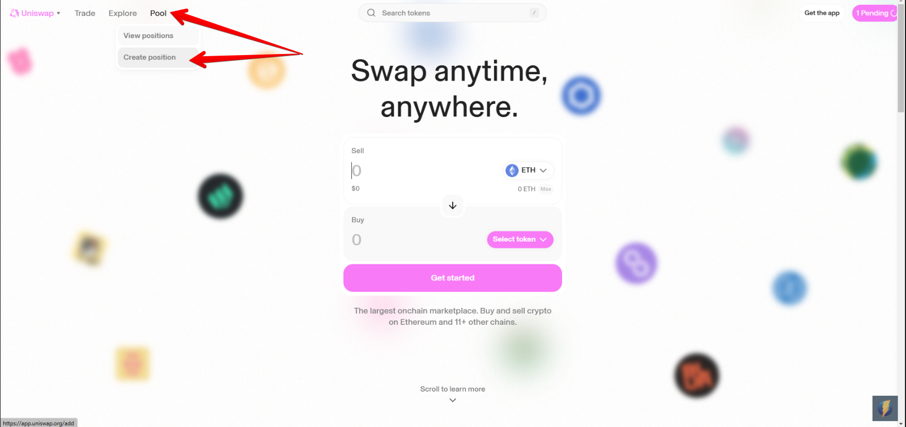
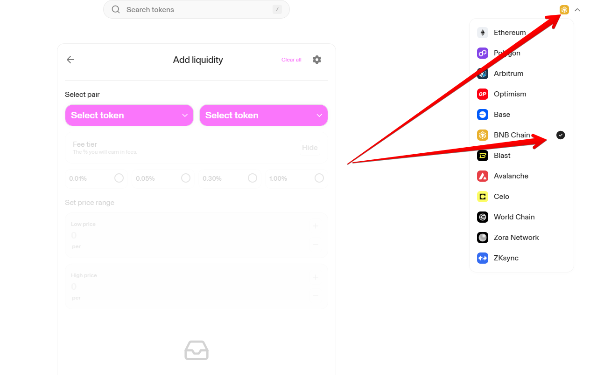
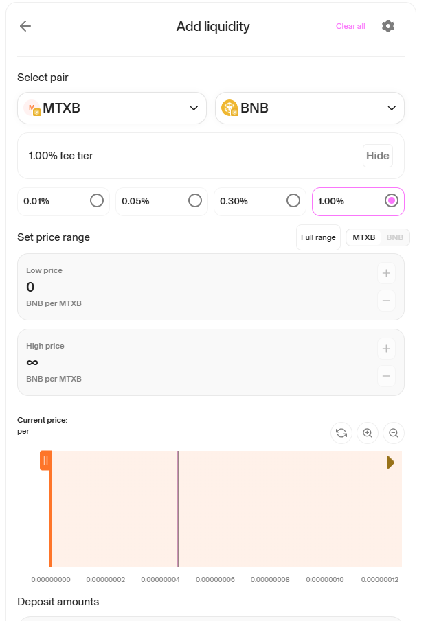
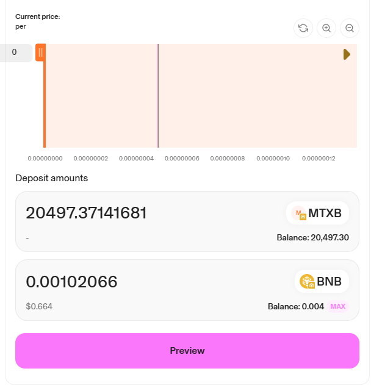

# Как добавить пул ликвидности MTXB в Uniswap

**Шаг 1.** Зайти на Uniswap [https://app.uniswap.org/](https://app.uniswap.org/) и подключить кошелёк (поддерживаются Uniswap Wallet, Exodus, MetaMask, WalletConnect, Coinbase Wallet). Отключить блокировщики рекламы, это важно. Будьте терпеливы, не нажимайте на кнопки многократно, иначе транзакций будет несколько.

Далее выберите Pools - Create position

<figure><figcaption></figcaption></figure>

**Шаг 2**. Выбрать блокчейн BNB Chain

<figure><figcaption></figcaption></figure>

**Шаг 3**. Выбрать монеты MTXB (Адрес контракта MTXB: `0x3A146E3EFB59567366B0C94FFFA97273736ADBB1`) и BNB, выбрать размер комиссии (например, 1%), диапазон цен (можно выбрать Full Range или задать определенный диапазон).

<figure><figcaption></figcaption></figure>

Ввести сумму токенов, или выбрать «Max» для максимального количества токенов.

<figure><figcaption></figcaption></figure>

**Шаг 4.** Нажать кнопку Preview, проверить данные позиции ликвидности, затем нажать кнопку Add и подтвердить транзакцию в кошельке.

<figure><figcaption></figcaption></figure>

После завершения вы сможете просматривать и управлять своей позицией ликвидности на странице пула V3 [https://app.uniswap.org/pools](https://app.uniswap.org/pools).

Готово! Поздравляем, вы молодцы! Теперь будут собираться комиссии, которые можно будет периодически выводить к себе на кошелек.
