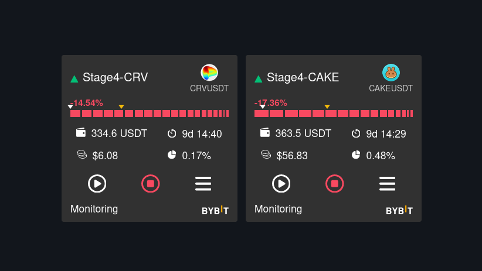
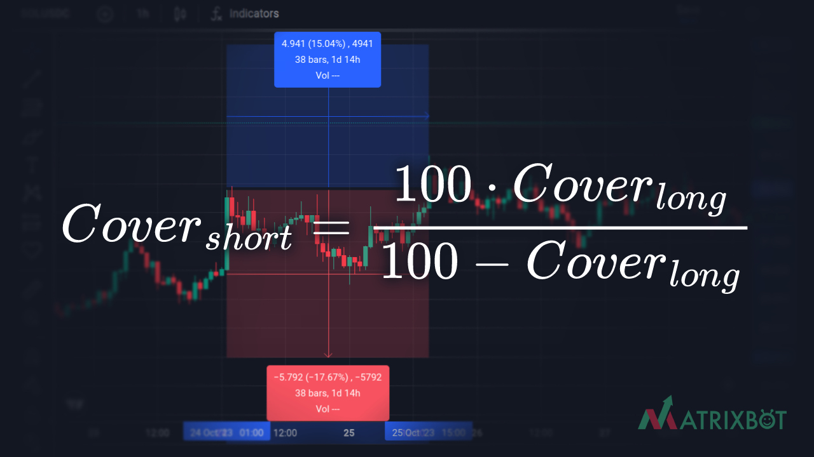
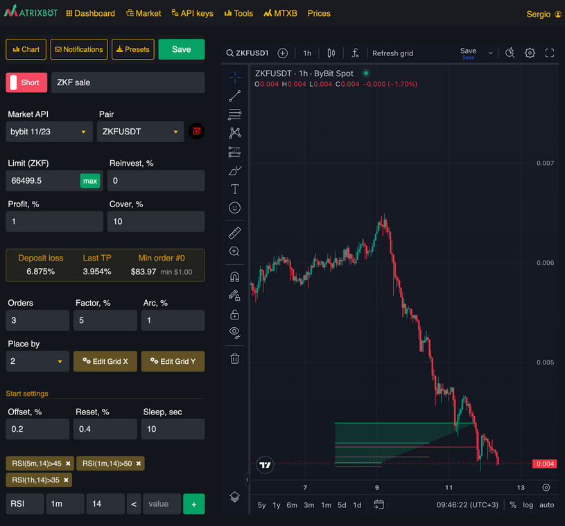

# Что делать при уходе в инвест?

<figure><figcaption></figcaption></figure>

Чтобы выйти из инвеста, для начала проанализируем почему бот в него попал.

#### Возможные причины:

1. влияние новостей;
2. свойственное для выбранной монеты рыночное поведение;
3. техническая причина: слишком агрессивные настройки бота.

### Рассмотрим типовые ситуации

**Ситуация 1**: слишком агрессивные настройки LONG бота:

* небольшое покрытие ордеров (параметр **cover**);
* слишком малое значение усреднения (**factor**);
* слишком большое значение ожидамого профита (**profit**).

В этой ситуации бот накопил монеты, и чтобы актив не простаивал, можно запустить SHORT бота на эту сумму монет, чтобы ее увеличить. Главное избегать FOMO, чтобы не получить вторичный инвест.

#### Основные правила для выхода из этой ситуации:

* **cover** должен быть в 2 раза (или больше), чем расстояние до Take Profit ордера LONG бота. Визуализацию сетки можно увидеть при редактировании бота, чтобы оценить эти расстояния по графику;
* следует использовать высокое значение **factor,** чтобы параметр **Last TP** был на уровне 50% от значения **cover**, чтобы сетка хорошо собирала и маленькие отскоки цены, ведь больших отскоков может не возникнуть при активном росте;
* больше ордеров в сетке - лучше, так более часто будет происходить усреднение позиции и ловля всех отскоков;
* стоит настроить аккуратный вход в позицию на основе [технических индикаторов](../indikatory.md).
* **cover** для SHORT бота можно рассчитать на основе cover LONG бота следующим образом:

<figure><figcaption></figcaption></figure>

Пример: пусть cover для LONG бота у тебя 20%, тогда cover для SHORT бота будет = 20% / (100%-20%) = 25%. Это происходит из-за того, что проценты сверху вниз и снизу вверх - разные проценты, просто делаем их пересчет.

### Пример ботов, которые помогают выйти из инвеста, можно найти на [Маркете](https://matrixbot.io/market) с именем "anti-invest".

***

**Ситуация 2**: цена резко ушла вниз, отскок был небольшим и бот его не поймал, актив продолжил торговаться в другом диапазоне.

#### Основные правила для выхода из этой ситуации:

* принимать решение на холодную голову;
* смириться с этим небольшим убытком;
* если уверен в настройках бота, запустить его заново для входа в новую позицию;
* если необходимо, скорректировать настройки, запустить бота заново.

В трейдинге такое бывает, но боты способны отработать эти убытки и продолжить зарабатывать.

***

**Ситуация 3**: про монету появились негативные новости на долгосрочный период, например:

1. делистинг монеты с крупной биржи;
2. проблемы у команды монеты;
3. инфраструктурные поломки и тд.

В этом случае стоит аккуратно выйти из этого актива с помощью SHORT бота.

#### Основные правила для выхода из этой ситуации:

* создаем SHORT бота с 3-5 ордерами;
* оцениваем отскоки в %, которые были при падении, на эту величину выставляем **cover**;
* выставляем такие индикаторы, чтобы бот продавал на хаях, например, `RSI > 50`;
* если необходимо быстро избавиться от актива, можно выставить сетку всего 1 ордером при условиях индикатора `RSI > 60`. **Profit** можно выставить на уровне 0.7 или больше.

В этом случае получится очень агрессивный бот на продажу, способный заметно увеличить актив, если цена сохранит волатильность, что позволит отбить минус.

### Примеры таких ботов можно найти на [Маркете](https://matrixbot.io/market) с именем "sale".

<figure><figcaption>
Пример настроек
</figcaption></figure>

***

Успешный трейдинг - это не 100% успешных сделок, а положительное соотношение прибыли и убытка от множества сделок. Удачной торговли!
