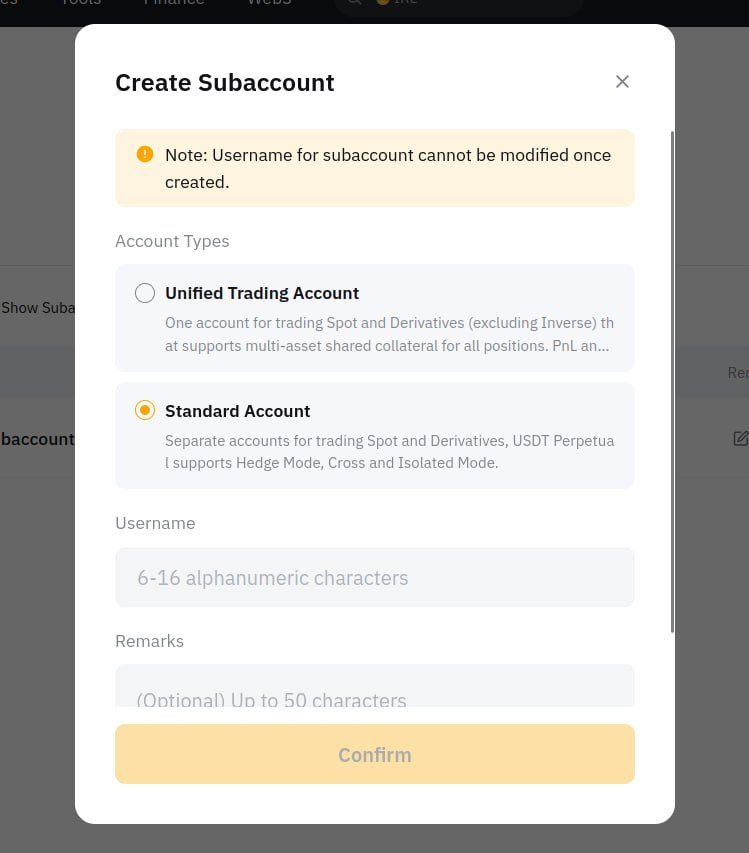
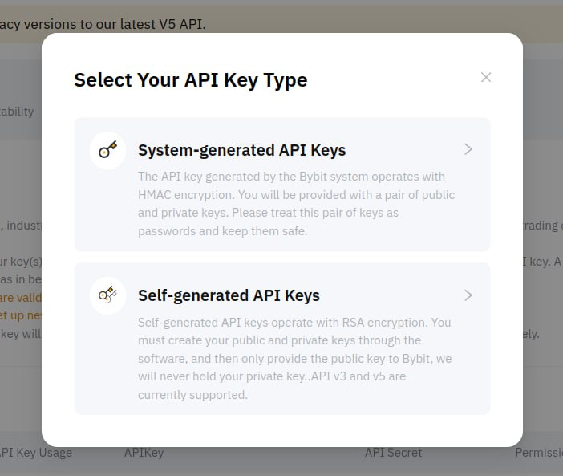
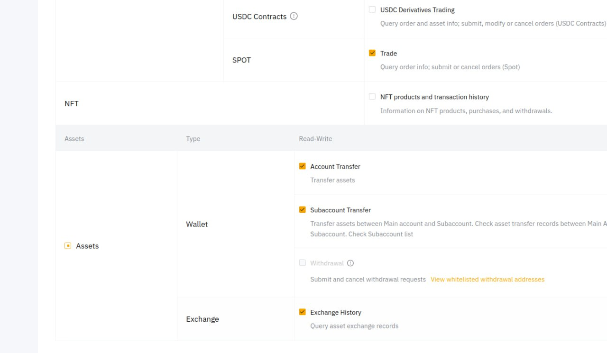

# Создаем API ключ на Bybit

По умолчанию Bybit открывает "unified account" счета для своих клиентов, поэтому необходимо создать sub-account, в котором получить API ключ к Spot рынку. Дело в том, что API ключи к "unified account" и "spot" - считаются как ключи к разным рынкам.

1. [Создаем sub-account](https://www.bybit.com/app/user/sub-account) для торговых ботов. Выбери "Standart Subaccount".

<figure><figcaption></figcaption></figure>

2. Далее выбери тип - "Standart account".

<figure><figcaption></figcaption></figure>

3. В созданном sub-account найди ссылку "API Management":

<figure><figcaption></figcaption></figure>

4. Создай API ключ для управления этим счетом. В качестве типа API ключа выбери "System-generated API Keys":

<figure><figcaption></figcaption></figure>

5. Выставь следующие разрешения ключу, чтобы бот мог запрашивать баланс, информацию об ордерах и производить торговлю:

<figure><figcaption></figcaption></figure>

6. Сохрани полученные публичный и приватный ключи. Добавь их к своему аккаунту в MatrixBot [в разделе API keys.](https://matrixbot.io/apikeys)

Готово! Можно запускать ботов!
